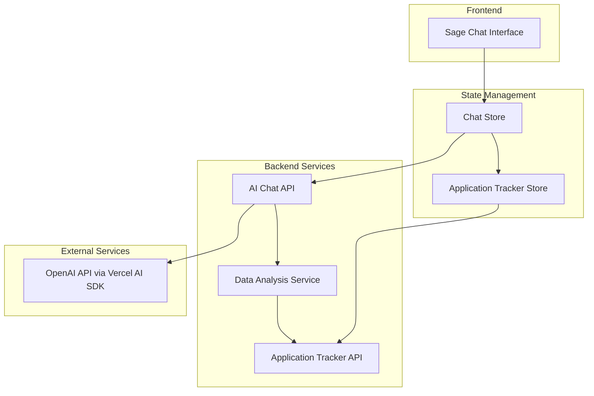

# Design Document

## Overview

The Chat with Your Job Search Data feature provides a conversational AI interface where users can ask Sage about their job search progress and receive data-driven insights. The system analyzes the user's pipeline data to answer natural language questions, provide strategic recommendations based on data patterns, and transform static application tracker data into actionable intelligence through conversation.

**Core Functionality:**

- Natural language querying of job search metrics and progress
- Strategic recommendations based on pipeline data analysis
- Real-time integration with existing job application tracker
- Conversational interface that makes data accessible and actionable

## Architecture

### High-Level Architecture



### Component Interaction Flow

1. **Chat Query Flow**: User asks question → Chat Store processes query → AI Chat API analyzes pipeline data → Returns data-driven response
2. **Data Integration**: Chat system accesses Application Tracker Store for real-time job search data and metrics
3. **AI Processing**: Natural language queries are processed using Vercel AI SDK with job search context

## Components and Interfaces

### 1. Sage Chat Interface Component

**Location**: `app/components/ai-assistant/SageChatInterface.vue`

**Purpose**: Provides conversational AI interface for querying job search data and receiving strategic insights

**Key Features**:

- Natural language processing for job search queries
- Real-time streaming responses using Vercel AI SDK
- Context-aware responses based on user's pipeline data
- Chat history persistence within session

**Props Interface**:

```typescript
interface SageChatProps {
  // No props - component manages its own state via store
}
```

**Component Structure**:

```vue
<script setup lang="ts">
import { useAIChatStore } from '~/stores/aiChat';
import { storeToRefs } from 'pinia';

const chatStore = useAIChatStore();
const { messages, isTyping, isConnected } = storeToRefs(chatStore);

const messageInput = ref('');

async function sendMessage() {
  if (!messageInput.value.trim()) return;

  await chatStore.sendMessage(messageInput.value);
  messageInput.value = '';
}
</script>

<template>
  <UCard>
    <!-- Chat messages area -->
    <!-- Message input with send button -->
    <!-- Typing indicator -->
  </UCard>
</template>
```

### 2. AI Chat Page Layout

**Location**: `app/pages/ai-chat.vue`

**Purpose**: Main page that hosts the chat interface with proper responsive layout

**Layout Structure**:

```vue
<script setup lang="ts">
// Page-level data management
const applicationStore = useApplicationTrackerStore();

onMounted(() => {
  // Ensure application data is loaded for AI chat
  applicationStore.fetchApplications();
});
</script>

<template>
  <div class="ai-coaching-layout">
    <!-- Single chat interface, full width -->
    <div class="max-w-4xl mx-auto">
      <SageChatInterface />
    </div>
  </div>
</template>
```

## Data Models

### Chat Message Model

```typescript
interface ChatMessage {
  id: string;
  content: string;
  role: 'user' | 'assistant';
  timestamp: Date;
  chatSessionId: string;
  metadata?: {
    queryType?: 'data' | 'strategy' | 'next-steps';
    referencedApplications?: string[];
    confidence?: number;
  };
}

interface ChatSession {
  id: string;
  userId: string;
  title: string;
  createdAt: Date;
  updatedAt: Date;
  messages: ChatMessage[];
  context: {
    userProfile: UserProfile;
    jobSearchGoals: string[];
    preferences: Record<string, any>;
  };
}

interface UserProfile {
  name: string;
  targetRoles: string[];
  experienceLevel: string;
  preferredIndustries: string[];
  location: string;
  jobSearchStartDate: Date;
  goals: string[];
  challenges: string[];
  communicationStyle: 'direct' | 'supportive' | 'detailed';
}
```

### AI Analysis Context Model

```typescript
interface AIAnalysisContext {
  applications: JobApplication[];
  recentActivity: {
    applicationsThisWeek: number;
    interviewsScheduled: number;
    followUpsNeeded: number;
  };
  pipelineMetrics: {
    totalApplications: number;
    responseRate: number;
    interviewRate: number;
    stageDistribution: Record<ApplicationStage, number>;
  };
  userProfile: {
    targetRoles: string[];
    experienceLevel: string;
    preferredIndustries: string[];
  };
}
```

## AI Implementation with Vercel AI SDK

### Vercel AI SDK Integration

The chat functionality uses Vercel AI SDK for streaming responses and conversation management:

**Key Features**:

- Streaming responses for real-time chat experience
- Built-in conversation memory and context management
- Support for multiple AI providers (OpenAI, Anthropic, etc.)
- Automatic token counting and optimization

**Implementation Location**: `server/api/ai/chat.post.ts`

```typescript
import { streamText } from 'ai';
import { openai } from '@ai-sdk/openai';

export default defineEventHandler(async (event) => {
  const { message, conversationId, userId } = await readBody(event);

  // Load conversation history and user context
  const conversation = await loadConversation(conversationId, userId);
  const userProfile = await loadUserProfile(userId);
  const jobSearchContext = await buildJobSearchContext(userId);

  // Build system prompt with user context
  const systemPrompt = buildSystemPrompt(userProfile, jobSearchContext);

  const result = await streamText({
    model: openai('gpt-4-turbo'),
    system: systemPrompt,
    messages: [...conversation.messages, { role: 'user', content: message }],
    maxTokens: 1000,
    temperature: 0.7,
  });

  // Save message to conversation
  await saveMessageToConversation(conversationId, message, result.text);

  return result.toAIStreamResponse();
});
```

### Conversation Memory Strategy

**Short-term Memory** (Current Session):

- Last 20 messages in conversation
- Current job search context and recent activity
- User's immediate goals and questions

**Long-term Memory** (Persistent):

- User profile and preferences
- Job search history and patterns
- Previous coaching insights and recommendations
- User's communication style preferences

**Context Building**:

```typescript
function buildSystemPrompt(
  userProfile: UserProfile,
  jobSearchContext: AIAnalysisContext
): string {
  return `You are Sage, an expert job search coach for ${userProfile.name}.

User Context:
- Target roles: ${userProfile.targetRoles.join(', ')}
- Experience level: ${userProfile.experienceLevel}
- Job search started: ${userProfile.jobSearchStartDate}
- Communication style: ${userProfile.communicationStyle}
- Current goals: ${userProfile.goals.join(', ')}

Current Job Search Status:
- Total applications: ${jobSearchContext.pipelineMetrics.totalApplications}
- Response rate: ${jobSearchContext.pipelineMetrics.responseRate}%
- Recent activity: ${
    jobSearchContext.recentActivity.applicationsThisWeek
  } applications this week

Remember previous conversations and provide personalized, contextual advice based on their specific situation and progress.`;
}
```

## Store Architecture

### Sage AI Chat Store

**Location**: `app/stores/aiChat.ts`

```typescript
export const useSageChatStore = defineStore('aiChat', () => {
  const messages = ref<ChatMessage[]>([]);
  const isTyping = ref(false);
  const isConnected = ref(true);
  const currentChatSessionId = ref<string | null>(null);
  const streamingMessage = ref<string>('');

  async function initializeChatSession() {
    if (!currentChatSessionId.value) {
      const chatSession = await $fetch<ChatSession>('/api/ai/chat-sessions', {
        method: 'POST',
      });
      currentChatSessionId.value = chatSession.id;
      messages.value = chatSession.messages;
    }
  }

  async function sendMessage(content: string) {
    await initializeChatSession();

    // Add user message
    const userMessage: ChatMessage = {
      id: generateId(),
      content,
      role: 'user',
      timestamp: new Date(),
      chatSessionId: currentChatSessionId.value!,
    };
    messages.value.push(userMessage);

    isTyping.value = true;
    streamingMessage.value = '';

    try {
      // Create assistant message placeholder for streaming
      const assistantMessage: ChatMessage = {
        id: generateId(),
        content: '',
        role: 'assistant',
        timestamp: new Date(),
        chatSessionId: currentChatSessionId.value!,
      };
      messages.value.push(assistantMessage);

      // Stream response using Vercel AI SDK
      const response = await fetch('/api/ai/chat', {
        method: 'POST',
        headers: { 'Content-Type': 'application/json' },
        body: JSON.stringify({
          message: content,
          chatSessionId: currentChatSessionId.value,
          userId: 'current-user-id', // Get from auth
        }),
      });

      if (!response.body) throw new Error('No response body');

      const reader = response.body.getReader();
      const decoder = new TextDecoder();

      while (true) {
        const { done, value } = await reader.read();
        if (done) break;

        const chunk = decoder.decode(value);
        const lines = chunk.split('\n');

        for (const line of lines) {
          if (line.startsWith('data: ')) {
            try {
              const data = JSON.parse(line.slice(6));
              if (data.content) {
                assistantMessage.content += data.content;
                streamingMessage.value = assistantMessage.content;
              }
            } catch (e) {
              // Skip invalid JSON
            }
          }
        }
      }
    } catch (error) {
      console.error('Failed to send message:', error);
      // Replace last message with error
      messages.value[messages.value.length - 1] = {
        id: generateId(),
        content: 'Sorry, I encountered an error. Please try again.',
        role: 'assistant',
        timestamp: new Date(),
        chatSessionId: currentChatSessionId.value!,
      };
    } finally {
      isTyping.value = false;
      streamingMessage.value = '';
    }
  }

  async function loadChatSessionHistory() {
    if (currentChatSessionId.value) {
      const chatSession = await $fetch<ChatSession>(
        `/api/ai/chat-sessions/${currentChatSessionId.value}`
      );
      messages.value = chatSession.messages;
    }
  }

  function clearChat() {
    messages.value = [];
    currentChatSessionId.value = null;
  }

  return {
    messages: readonly(messages),
    isTyping: readonly(isTyping),
    isConnected: readonly(isConnected),
    streamingMessage: readonly(streamingMessage),
    currentChatSessionId: readonly(currentChatSessionId),
    sendMessage,
    loadChatSessionHistory,
    clearChat,
  };
});
```

## API Endpoints

### Chat Message Processing

**Endpoint**: `POST /api/ai/chat`

**Purpose**: Processes natural language queries using Vercel AI SDK with streaming responses and conversation memory

**Implementation**: Uses Vercel AI SDK for streaming responses and maintains conversation context

**Request Body**:

```typescript
{
  message: string;
  chatSessionId: string;
  userId: string;
}
```

**Response** (Streaming):

```typescript
{
  content: string // Streamed response chunks
  metadata?: {
    queryType: 'data' | 'strategy' | 'next-steps'
    referencedApplications?: string[]
    confidence?: number
  }
  chatSessionId: string
}
```

### Chat Session Management

**Endpoint**: `POST /api/ai/chat-sessions`

**Purpose**: Creates a new chat session with user context initialization

**Response**:

```typescript
{
  chatSession: ChatSession;
}
```

**Endpoint**: `GET /api/ai/chat-sessions/:chatSessionId`

**Purpose**: Retrieves chat session history and context

**Response**:

```typescript
{
  chatSession: ChatSession;
}
```

**Endpoint**: `GET /api/ai/chat-sessions`

**Purpose**: Lists user's chat session history

**Response**:

```typescript
{
  chatSessions: ChatSession[]
}
```

### Job Search Statistics

**Endpoint**: `GET /api/statistics/jobSearch`

**Purpose**: Retrieves current job search metrics and analytics data

**Response**:

```typescript
{
  statistics: {
    totalApplications: number;
    applicationsThisWeek: number;
    responseRate: number;
    interviewRate: number;
    stageDistribution: Record<ApplicationStage, number>;
    recentActivity: {
      applicationsThisWeek: number;
      interviewsScheduled: number;
      followUpsNeeded: number;
    }
  }
}
```

## Error Handling

### Frontend Error Handling

1. **Network Errors**: Display user-friendly messages with retry options
2. **AI Service Errors**: Graceful degradation with fallback responses
3. **Data Loading Errors**: Show loading states and error boundaries

### Backend Error Handling

1. **AI API Rate Limits**: Implement exponential backoff and queuing
2. **Data Analysis Failures**: Provide default recommendations when analysis fails
3. **Context Building Errors**: Handle missing or incomplete application data gracefully

### Error Recovery Strategies

```typescript
// Example error handling in stores
async function generateDailyPlan() {
  loading.value = true;
  try {
    const context = await buildAnalysisContext();
    const response = await $fetch('/api/ai/generate-daily-plan', {
      method: 'POST',
      body: { context },
      retry: 3,
      retryDelay: 1000,
    });

    dailyPlan.value = response;
  } catch (error) {
    // Fallback to default plan if AI generation fails
    dailyPlan.value = generateFallbackPlan();
    console.error('AI plan generation failed, using fallback:', error);
  } finally {
    loading.value = false;
  }
}
```

## Testing Strategy

### Unit Testing

1. **Store Logic**: Test state management, API calls, and data transformations
2. **Component Behavior**: Test user interactions, prop handling, and event emissions
3. **Utility Functions**: Test data analysis and context building functions

### Integration Testing

1. **Component Integration**: Test interaction between chat and planning components
2. **Store Integration**: Test data flow between stores and API endpoints
3. **API Integration**: Test backend service integration with mock AI responses

### E2E Testing

2. **Chat Interaction Flow**: Test natural language queries and response handling
3. **Mobile Responsiveness**: Test component behavior across different screen sizes

### Testing Tools

- **Vitest**: Unit and integration testing
- **Vue Test Utils**: Component testing
- **Playwright**: E2E testing
- **MSW**: API mocking for tests

## Performance Considerations

### Frontend Optimization

1. **Lazy Loading**: Load AI components only when needed
2. **Message Virtualization**: Implement virtual scrolling for long chat histories
3. **Debounced Inputs**: Prevent excessive API calls during typing
4. **Caching**: Cache daily plans and recent chat responses

### Backend Optimization

1. **Response Caching**: Cache AI responses for similar queries
2. **Context Optimization**: Minimize data sent to AI services
3. **Streaming Responses**: Implement streaming for long AI responses
4. **Rate Limiting**: Implement user-based rate limiting for AI calls

### Mobile Performance

1. **Touch Optimization**: Ensure smooth scrolling and touch interactions
2. **Bundle Size**: Minimize JavaScript bundle size for faster loading
3. **Offline Handling**: Provide offline capabilities for viewing cached data
